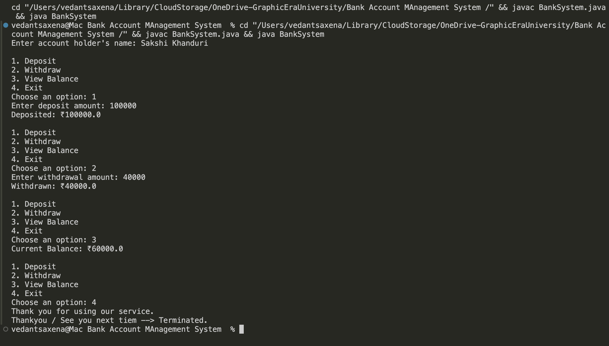

# 🏦 Bank Account Management System


> **"Secure. Simple. Efficient."**

The **Bank Account Management System** is a robust and user-friendly command-line Java application that brings the core experience of online banking right to your terminal. Users can **create accounts**, **deposit funds**, **withdraw money**, **view balances**, and enjoy **persistent account storage** between sessions.

---

## 🚀 Features

- 💳 **Create Accounts**: Seamlessly register a new bank account.
- 💵 **Deposit Funds**: Securely add money into your account.
- 💸 **Withdraw Funds**: Withdraw funds with real-time balance checks.
- 📈 **View Balance**: Instantly check your account balance.
- 🛡️ **Robust Error Handling**: Graceful responses to invalid inputs, insufficient funds, and more.
- 🔒 **Persistent Storage**: Your accounts are safe even after you exit the program!

---

## 🛠️ Built With

- **Java** - Core Programming Language
- **OOP Principles** - Encapsulation, Abstraction
- **Custom Exception Handling** - `InvalidAmountException`, `InsufficientFundsException`
- **File I/O** - Data persistence using text file storage
- **CLI** - Command-Line Interface for intuitive interaction

---

## 📂 Project Structure

```
.
├── BankSystem.java                  # Main application file
├── BankAccount.class                 # Compiled BankAccount class
├── InvalidAmountException.class      # Custom exception for invalid deposits/withdrawals
├── InsufficientFundsException.class  # Custom exception for insufficient funds
├── accounts.txt                      # Storage file for user accounts
├── LICENSE                           # Project license
├── README.md                         # Project documentation
└── .gitignore                        # Git ignore file
```

---

## 🛎️ Getting Started

### ✨ Clone the Repository
```bash
git clone https://github.com/vedsaxena6987/Bank-Account-Management-System.git
cd Bank-Account-Management-System
```

### 📚 Compile the Code
```bash
javac BankSystem.java
```

### 🏃‍♂️ Run the Application
```bash
java BankSystem
```

---

## 📷 Screenshots

> 


---

## 📖 License

This project is licensed under the **Apache License 2.0** — see the [LICENSE](LICENSE) file for details.

---

## 🤝 Contributing

We welcome contributions! Feel free to:
- ✨ Fork the repository
- 📅 Create a new branch
- 📊 Make your changes
- 📥 Submit a pull request

Let's build something amazing together!

---

# ❤️ Made with love by **Vedant Saxena**

---

[](https://github.com/vedsaxena6987/Bank-Account-Management-System) [](https://github.com/vedsaxena6987/Bank-Account-Management-System/fork) [](https://github.com/vedsaxena6987/Bank-Account-Management-System/blob/main/LICENSE)

